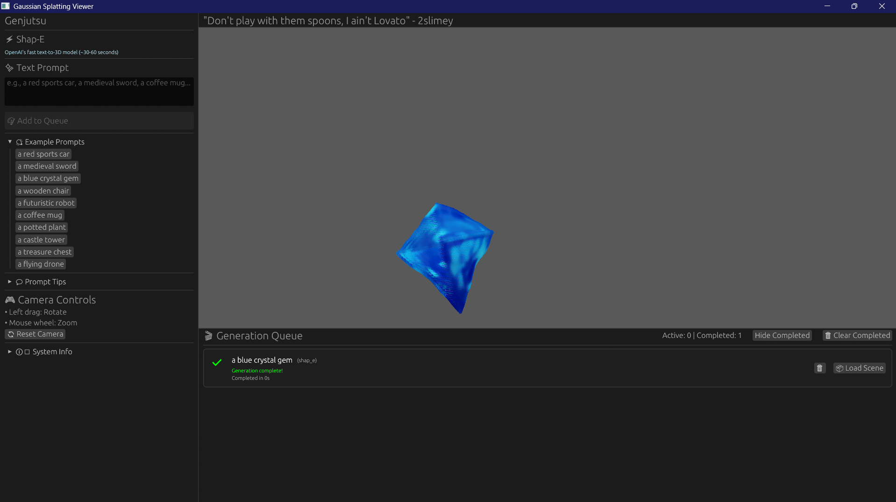

# genjutsu

A desktop app for generating interactive 3D scenes from text prompts using Gaussian Splatting rendering and OpenAI's Shap-E model.




## Features

- ** Text-to-3D Generation**: Create 3D models from text descriptions using Shap-E
- ** Real-time Gaussian Splatting**: 3D rendering using WebGPU
- ** Asynchronous Processing**: Non-blocking generation with live progress updates
- ** Cross-platform**: Works on Windows, macOS, and Linux
- ** Docker Support**: Easy deployment with Docker Compose
- ** Job Queue System**: Redis + Celery for robust task management + SurrealDB for storage

## Quick Start

### Prerequisites

- **Rust**: 1.75+ ([Install](https://rustup.rs/))
- **Docker & Docker Compose**: For Python service ([Install](https://docs.docker.com/get-docker/))
- **GPU**: NVIDIA GPU recommended (CPU fallback available)

### Installation

1. **Clone the repository**
```bash
git clone https://github.com/gang-misinformation/genjutsu.git
cd genjutsu
```

2. **Start Python services (Docker)**
```bash
cd python
docker-compose up -d

# Check services are running
docker-compose ps
curl http://localhost:5000/health
```

3. **Build and run Rust app**
```bash
cd ..  # Back to project root
cargo build --release
cargo run --release
```

## Usage

### Text-to-3D Generation

1. Enter a text prompt in the sidebar (e.g., "a red sports car")
2. Click "Generate 3D Model"
3. Wait for generation to complete (~60-90 seconds)
4. Interact with the generated 3D model

**Example Prompts:**
- `a yellow rubber duck`
- `a blue crystal gem`
- `a wooden chair`
- `a futuristic spaceship`
- `a medieval sword`
- `a coffee mug`

### Camera Controls

- **Rotate**: Left-click and drag
- **Zoom**: Mouse wheel
- **Reset**: Click "Reset Camera" button

### Shap-E Settings

In `python/shared/config.py`:

```python
DEFAULT_GUIDANCE_SCALE = 15.0       # Higher = more prompt adherence
DEFAULT_NUM_INFERENCE_STEPS = 64    # More steps = better quality
```

## Troubleshooting

### Services won't start

```bash
# Check Docker is running
docker ps

# Check service logs
cd python
docker-compose logs api
docker-compose logs worker

# Restart services
docker-compose down
docker-compose up -d
```

**Common fixes:**

1. **Wrong volume mount** - Check `python/docker-compose.yml`:
   ```yaml
   volumes:
     - ../outputs:/app/outputs  # Correct
   # NOT:
     - ./outputs:/app/outputs   # Wrong
   ```

2. **Missing outputs directory**:
   ```bash
   mkdir -p outputs
   ```

3. **Rebuild after fixes**:
   ```bash
   cd python
   docker-compose down
   docker-compose up -d
   cd ..
   cargo build --release
   ```

### Slow rendering / Low FPS

- **Reduce Gaussian count**: Increase opacity threshold in renderer
- **Lower resolution**: Reduce window size
- **Update GPU drivers**: Ensure latest drivers installed

### API connection failed

```bash
# Check API is running
curl http://localhost:5000/health

# Should return:
# {"status": "healthy", "workers": 1, ...}

# If not, check logs
docker-compose logs api
```

## Technical Details

### Gaussian Splatting

This project uses **3D Gaussian Splatting** for rendering, which represents scenes as collections of 3D Gaussians with:
- **Position**: 3D center point
- **Scale**: Size along each axis
- **Rotation**: Quaternion orientation
- **Color**: RGB appearance
- **Opacity**: Transparency

Each Gaussian is rendered as a textured quad with Gaussian falloff, blended using alpha compositing.

### Shap-E Model

**Shap-E** is OpenAI's text-to-3D model that:
1. Takes text prompt as input
2. Generates a latent 3D representation (~30-60 seconds)
3. Decodes to mesh/point cloud
4. Converts to Gaussian splats for rendering

**Key advantages:**
- Fast inference (~1 minute vs 5+ minutes for other models)
- Direct text-to-3D (no intermediate images needed)
- Produces clean, coherent 3D objects

### Asynchronous Architecture

- **Main thread**: UI and rendering (60 FPS target)
- **Worker thread**: API communication and file I/O
- **Python services**: GPU-accelerated 3D generation (Docker)
- **Redis**: Message queue and result storage
- **Celery**: Task management and progress tracking

This ensures the UI remains responsive during generation.

## API Documentation

Once services are running, visit:
- **Swagger UI**: http://localhost:5000/docs
- **ReDoc**: http://localhost:5000/redoc

### Key Endpoints

```bash
# Health check
GET /health

# Submit generation job
POST /generate
{
  "prompt": "a red car",
  "model": "shap_e",
  "guidance_scale": 15.0,
  "num_inference_steps": 64
}

# Check job status
GET /status/{job_id}

# List active workers
GET /workers
```

## Contributing

I don't care what you do with this.

## Shoutouts

- **Shap-E**: OpenAI's text-to-3D model ([Paper](https://arxiv.org/abs/2305.02463))
- **3D Gaussian Splatting**: Original rendering technique ([Paper](https://repo-sam.inria.fr/fungraph/3d-gaussian-splatting/))
- **egui**: Immediate mode GUI framework
- **wgpu**: WebGPU implementation in Rust

## Known Limitations

- Job queue system not fully fleshed out
- Large variance in wait times
- Splats are hella wonky and can lead to artifacts that resemble gouraud shading
